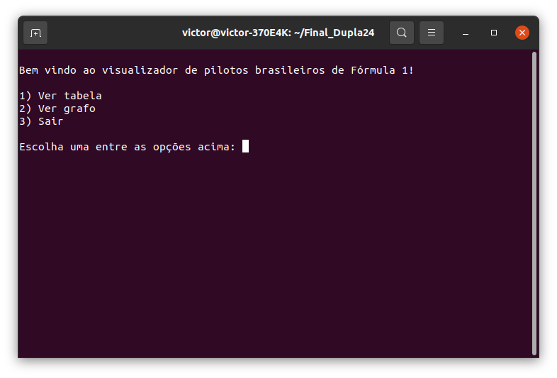
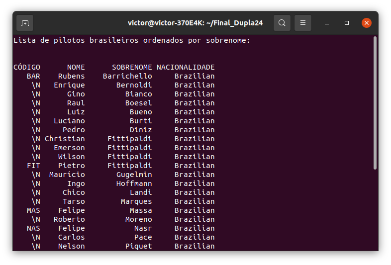
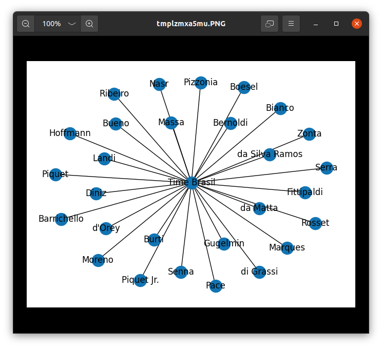

# 🏎️ Existe brasileiro na Fórmula 1?

**Número da Lista**: 6  
**Conteúdo da Disciplina**: FINAL 

## Alunos
|  Matrícula  |            Aluno           |
|    --       |             --             |
| 14/0031634  |  Stefânia Bezerra da Silva |
| 15/0150741  |  Victor Alves Gomide       |

## Sobre 
Neste trabalho final foi utilizado o Merge Sort (conteúdo do módulo "Dividir e Conquistar") para ordenar por ordem alfabética os nomes dos pilotos brasileiros em uma base de dados de pilotos da Fórmula 1 e gerar um grafo mostrando quem são eles.

## Screenshots
### Menu

### Tabela

### Grafo

## Instalação 
**Linguagem**: Python 
**Framework**: Não existe 

### Pré-requisitos
- Instalar o python  
`sudo apt install python3`

- Instalar o scipy  
`pip install scipy`

- Instalar o networkx  
`pip install networkx`

- Instalar o matplotlib  
`pip install matplotlib`

- Instalar o pandas  
`pip install pandas`

- Instalar o PIL  
`python3 -m pip install --upgrade Pillow`

## Uso 
Depois de instalar as dependências acima, o usuário precisará apenas compilar o código no terminal:

`python3 main.py`

